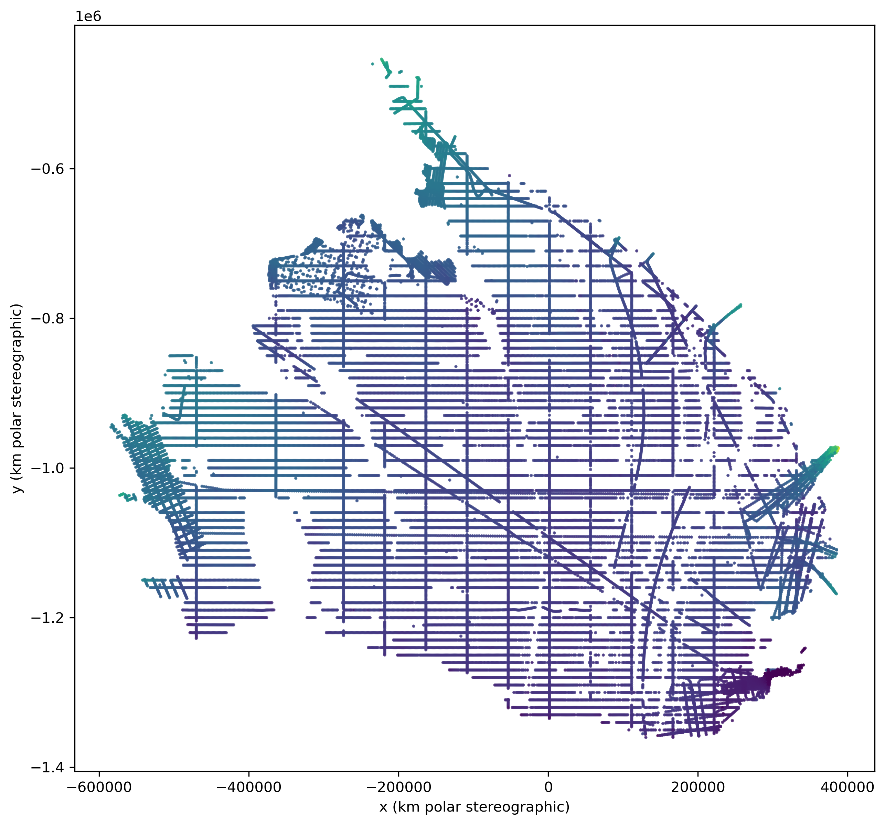

# Ice shelf flux decomposition

In this repository we learn the decomposition of the Ross ice shelf flux vector field into its divergence-free and curl-free vector field components (Helmholtz decomposition), with a Dissipative Hamiltionian Neural Network (DHNN, see [Sosanya et al. 2022](https://arxiv.org/abs/2201.10085)). Therein we aim to provide a new, machine learning based estimate of mass loss, that reflects the latest state of observation, and that can easily integrate new observations. The DHNN provides a continous (i.e. mesh-free) model of ice flux via an Implicit Neural Representation (INR), enabling flux divergences to be computed efficiently and at arbitraty spatial resolution via automatic differentiation. Furthermore, dividing the ice flux vector field by satilite-based ice velocity fields yields an ice thickness model for Ross ice shelf.

# Output

## Contributions
- Sea level rise attribution / **basal melt estimates**/ melt water production: 
    - Based on the work by [Rignot et al. 2013](https://www.science.org/doi/epdf/10.1126/science.1235798) **Ice-Shelf Melting Around Antarctica**.
        - InSAR velocities from 2007/2008.
        - RACMO smb long-term average between 1979 and 2010.
        - thinning rates (and steady-state)
    - "ice shelf basal melting is the largest ablation process in Antarctica"
    - They state “In the absence of vertical shear on floating ice, the surface-derived velocity is equivalent to a depth-averaged velocity.” Hence, our flux observations are much more trusthworthy in this area. Ice thickness observations are rather dense over Ross.
    - Calculate the flux divergence from the curl-free vector field component.
    - flux divergence = smb (net surfac mass balance) - bmb (basal mass balance i.e. basal melt) "the rate of ice-shelf thickening ∂H/∂t equals the sum of net surface mass balance SMB minus net basal melting B minus the lateral divergence in volume flux Hv"
    - ∂H/∂t = SMB – B - ∇ (H v)
    - B_ss (B steady state) is ∂H/∂t = 0
    - We have surface mass balance estimates from the regional climate model [RACMO 2.4](https://tc.copernicus.org/articles/18/4065/2024/) so that bmb (i.e. basal mass balance) can be inferred.
- See if we can attain better **ice shelf thickness interpolation** than Bedmap3 (which has small mean bias for Ross but strong spatial patterns and thus needs bias correction)
    - Bedmap3 applied (1) hydrostatic equilibrium and then (2) bias corrects.

# Ideas for future work
- Pretrain model on hydrostatic equilibrium, as done in Bedmap3
- Use ice shelf thinning data

## Proprocessing:
- Ice shelf mask from Bedmap3
- Erode mask edge by 5 km like in Bedmap3 paper

- directional guidance data set
    - get velocities on native 450 m grid
    - subset values on shelf (without edges) with mask
    - calculate unit velocity components 
    - export tensor with 2M data

# Region - Ross ice shelf
- 1000 x 1000 km region
- Ross ice shelf itself: ~ 500,000 km² (about the size of Spain)
- cold cavity
- ice shelves generally have high snowfall i.e. surface accumulation
- important role with regards to buttressing i.e. stability of the ice sheet
- Ross East and West are vey different: East looses half its mass through basal melting whilte the West doesn't have any basal melt water.
    - smb are similar but basal melt not
- Bedmap3 grid has ~ 2M points over the shelf

# Key words
- ice-ocean interactions
- climate attribution
- XAI (Explainable AI)
- meltwater production

# Equation

From Morlighem et al. (2011)
"A mass conservation approach for mapping glacier ice thickness"

dH/dt + ∇⋅(Hv) = M_s - M_b
It follows
- M_b = M_s - dH/dt - ∇⋅(Hv)
- dH/dt = M_s - M_b - ∇⋅(Hv) (stated by Rignot et al. in the Supplementary materials) Quote "At any point on an ice shelf of thickness H and velocity vector v, the rate of ice-shelf thickening ∂H/∂t equals the sum of net surface mass balance SMB minus net basal melting B minus the lateral divergence in volume flux Hv (15)."

- dH/dt -> thickness change rate
    - dH/dt > 0 (positive) -> ice shelf thickening
    - dH/dt < 0 (negative) -> ice shelf thinning
- ∇⋅(Hv) -> flux divergence [m / yr]
    - ∇⋅ -> divergence operator
    - H -> ice thickness [m]
    - v -> ice velocity [m / yr]
- M_b -> basal melt rate (or basal mass balance, defined as basal melt - basal freeze)[m / yr]
    - M_b > 0 (positive) -> melting
    - M_b < 0 (negative) -> freezing
    - NOTE: different sign conventions exist for this term
- M_s -> surface mass balance (i.e. smb) defined as (accumulation - ablation) [m / yr]
    - M_s > 0 (positive) -> accumulation
    - M_b < 0 (negative) -> ablation

- dH/dt where values > 0 indicate thickening rates and values < 0 indicate thinning rates.
- ∇ ⋅ is the divergence operator.
- H is vertical ice thickness in [m].
- v are ice velocities. For ice shelves surface velocities should equal depth-averaged velocities (no shear).
- smb is surface mass balance (accumulation - ablation) in [m / yr]
- basal melt in [m / yr]

# Inputs

## Ice thickenss

We use the Bedmap collection of ice thickness measurements. We combine all standardised .csv files from the Bedmap1, Bedmap2 and Bedmap3 collections from the [UK Polar Data Centre](https://www.bas.ac.uk/data/uk-pdc/). The lists of .csv files are visible on [this Bristish Antarctic Survey (BAS) webpage](https://www.bas.ac.uk/project/bedmap/#data).

Bedmap(3) references:
- *Pritchard, Hamish D., et al. "Bedmap3 updated ice bed, surface and thickness gridded datasets for Antarctica." Scientific data 12.1 (2025): 414.*
- *Frémand, Alice C., et al. "Antarctic Bedmap data: Findable, Accessible, Interoperable, and Reusable (FAIR) sharing of 60 years of ice bed, surface, and thickness data." Earth System Science Data 15.7 (2023): 2695-2710.*

## Ice velocity

We use [MEaSUREs Phase-Based Antarctica Ice Velocity Map, Version 1](https://nsidc.org/data/nsidc-0754/versions/1)

Reference:
- *Mouginot, J., Rignot, E. & Scheuchl, B. (2019). MEaSUREs Phase-Based Antarctica Ice Velocity Map. (NSIDC-0754, Version 1). [Data Set]. Boulder, Colorado USA. NASA National Snow and Ice Data Center Distributed Active Archive Center. https://doi.org/10.5067/PZ3NJ5RXRH10. Date Accessed 10-02-2025.*

## Surface mass balance (smb)

We use interpolated [Monthly RACMO2.4p1 data for Greenland (11 km) and Antarctica (27 km) for SMB, SEB, near-surface temperature and wind speed (2006-2015) Version 2](https://zenodo.org/records/13773130)

Reference:
- *Van Dalum, Christiaan T., Willem Jan van de Berg, Srinidhi N. Gadde, Maurice Van Tiggelen, Tijmen van der Drift, Erik van Meijgaard, Lambertus H. van Ulft, and Michiel R. Van Den Broeke. "First results of the polar regional climate model RACMO2. 4." The Cryosphere 18, no. 9 (2024): 4065-4088.*

## Thickening rates

[ATLAS/ICESat-2 L3B Gridded Antarctic and Arctic Land Ice Height Change, Version 4]
(https://nsidc.org/data/atl15/versions/4)

Use command line: https://search.earthdata.nasa.gov/downloads/5132364764

Reference
- "Smith, B., Sutterley, T., Dickinson, S., Jelley, B. P., Felikson, D., Neumann, T. A., Fricker, H. A., Gardner, A. S., Padman, L., Markus, T., Kurtz, N., Bhardwaj, S., Hancock, D. & Lee, J. (2024). ATLAS/ICESat-2 L3B Gridded Antarctic and Arctic Land Ice Height Change. (ATL15, Version 4). [Data Set]. Boulder, Colorado USA. NASA National Snow and Ice Data Center Distributed Active Archive Center. https://doi.org/10.5067/ATLAS/ATL15.004. Date Accessed 10-02-2025."

See [user guide](https://nsidc.org/sites/default/files/documents/user-guide/atl15-v004-userguide.pdf)

Overview of datasets [here](https://icesat-2.gsfc.nasa.gov/science/data-products)

# Other resources

- [Polar Iceshelf website](https://polar-iceshelf.org/news/)
- [Land-based ice height change between ICESat and ICESat-2](https://svs.gsfc.nasa.gov/4796/)
- [Adusumilli et al. 2020 Nature Geoscience paper, estimating basal melt](https://www.nature.com/articles/s41561-020-0616-z)
    - Lagrangian versus Euler method

# Limitations
- temporal mismatch
- noise

# ToDO

- [] use higher resolution smb map from [Noel et al. 2023 Higher Antarctic ice sheet accumulation and surface melt rates revealed at 2 km resolution](https://www.nature.com/articles/s41467-023-43584-6)
- [] integrate dH/dt to improve over steady state estimates
    - [] hydrostatic equilibrium needed to translate surface elevation change into thickness change
- [] produce thickness map
- [] use directional guidance if necessary
